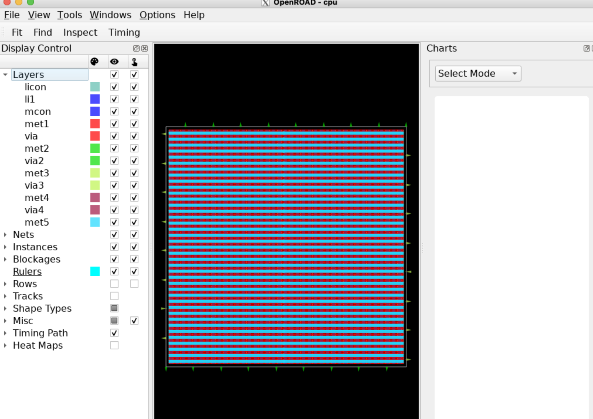
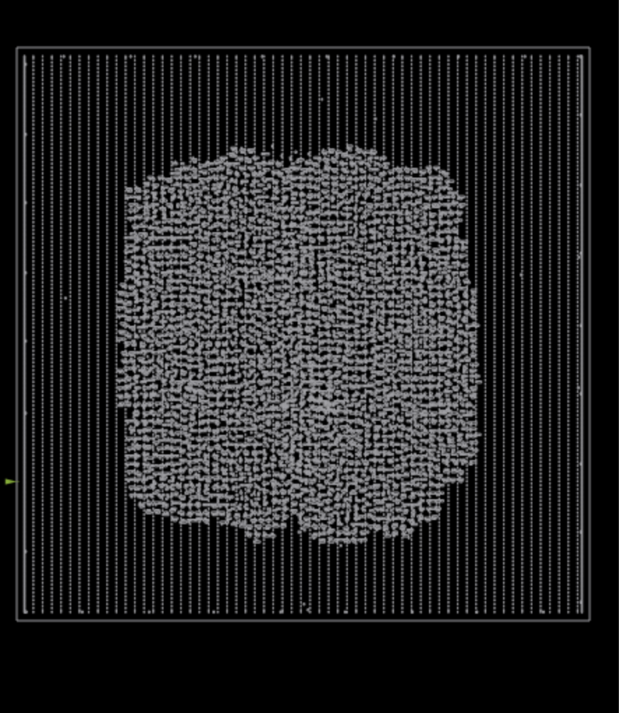
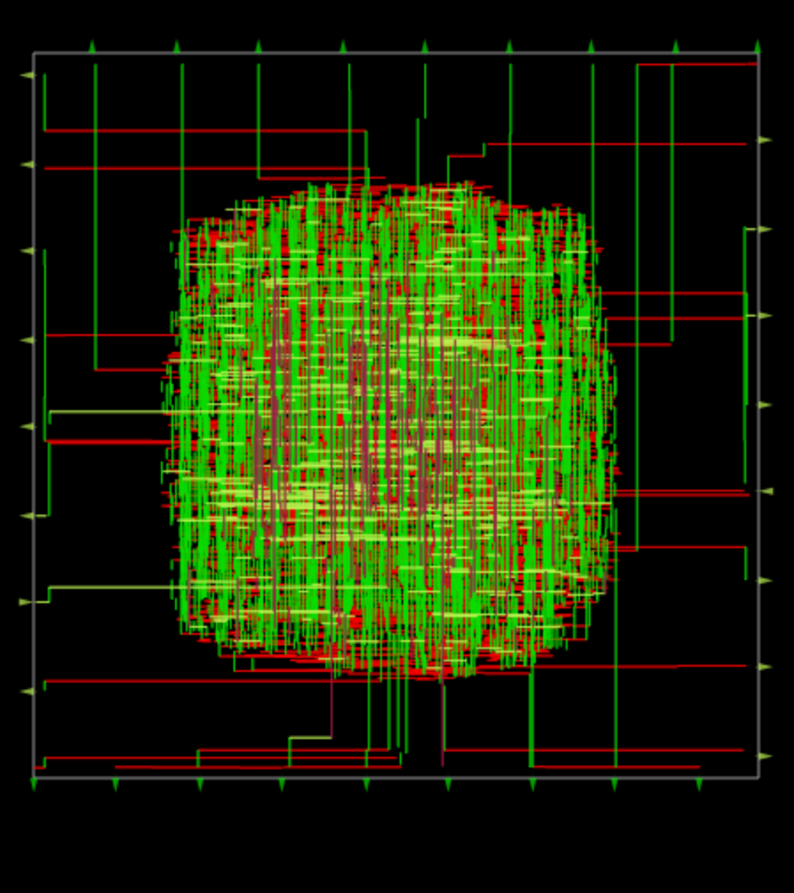
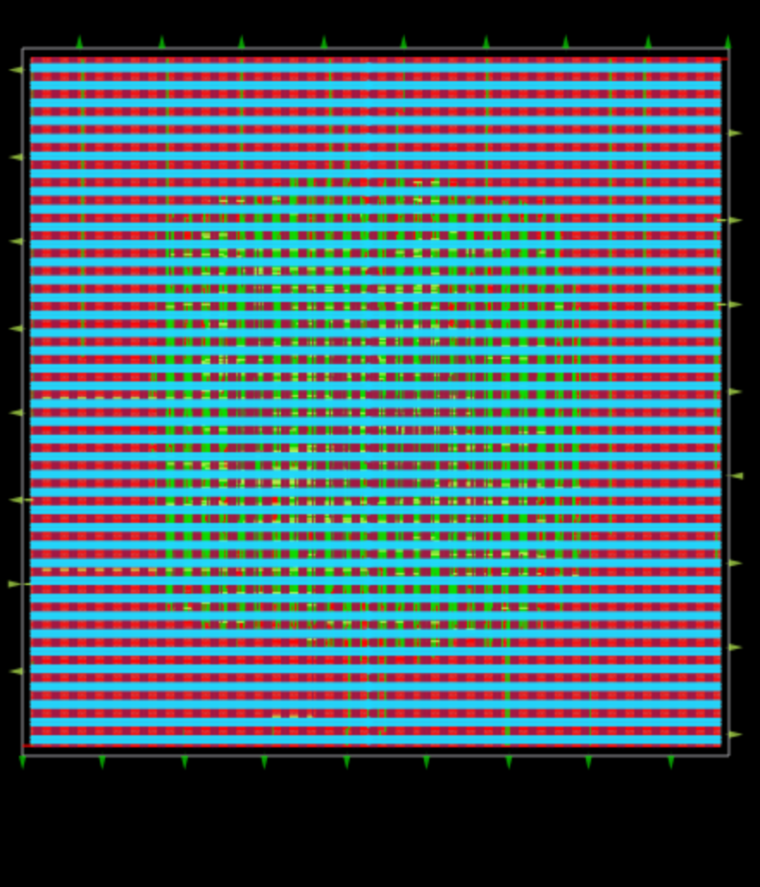
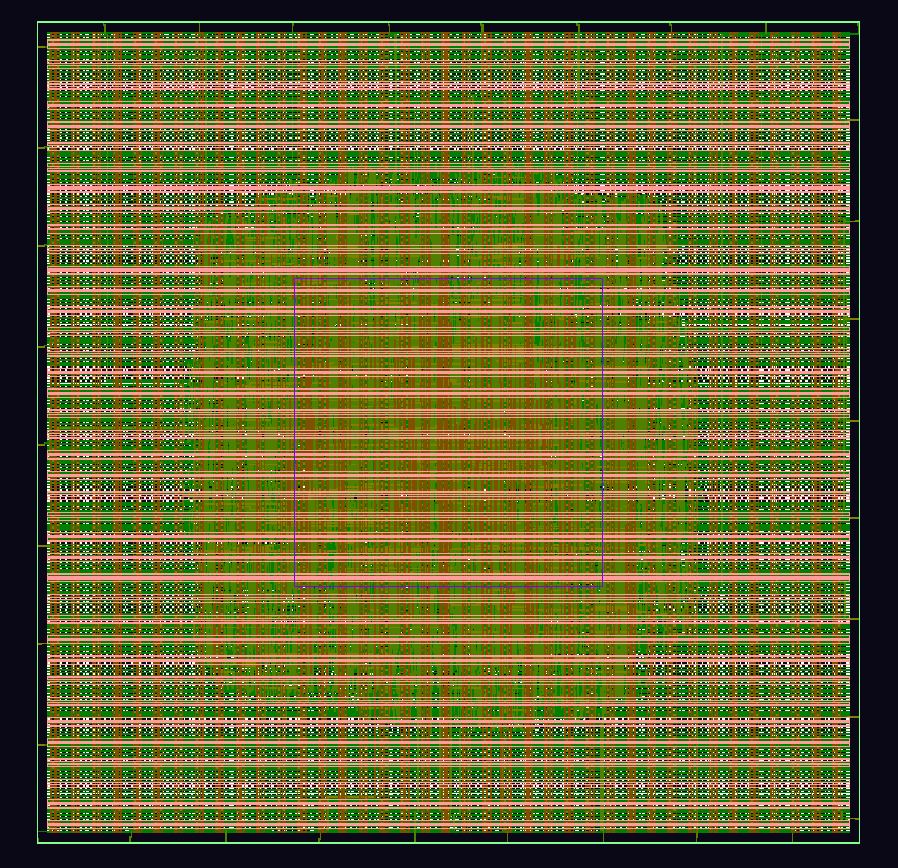

# 🔷 Mini RISC-V CPU (RTL to GDSII using OpenLane)

## 📌 Overview

This project implements a **Mini RISC-V CPU in Verilog** and demonstrates a complete **RTL-to-GDSII flow** using OpenLane and OpenROAD.

---

## 🚀 Flow Implemented

* RTL Design (Verilog)
* Synthesis (Gate-level netlist)
* Floorplanning (Core + IO placement)
* Placement (Standard cell placement)
* Routing (Multi-layer metal routing)
* Final Layout Visualization (OpenROAD GUI)
* GDS Visualization (Magic VLSI / KLayout)

---

## 🛠 Tools & Technologies

* Verilog HDL
* OpenLane
* OpenROAD
* Magic VLSI
* SKY130 PDK

---

## 📸 Results

### 🧱 Floorplan

---

### 📍 Placement

---

### 🔗 Routing

---

### 🧩 Final Layout

---

### 💎 GDS Layout

---

## 🧠 Key Learnings

* Complete **ASIC design flow (RTL → GDSII)**
* Physical design concepts (**placement, routing, floorplanning**)
* Working with **open-source EDA tools**
* Understanding of **chip layout and interconnections**

---

## 💼 Applications

* Processor design (**RISC-V architecture**)
* ASIC design flow understanding
* VLSI backend design practice

---

